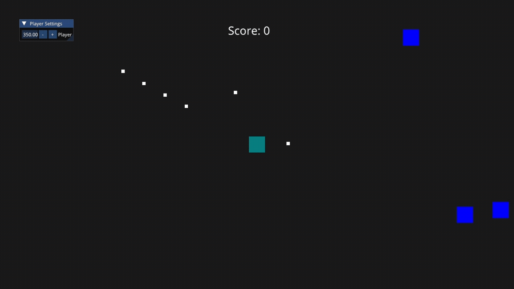
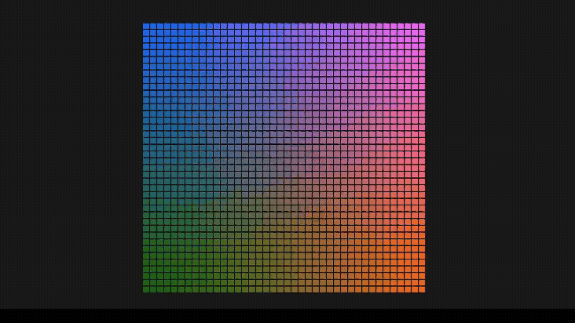
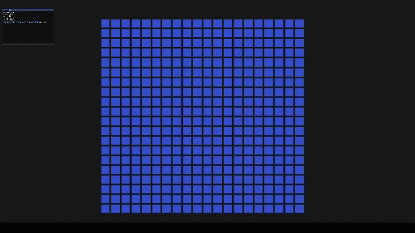

# Cabrankengine

Cabrankengine is a 2D/3D game engine written in C++ with OpenGL, designed for Windows and Linux (64-bit).  
The project is focused on learning, experimentation, and building a clear interface for game development.

---

## Showcase

Here are some examples of prototypes and experiments made with Cabrankengine:

### Vampire Survivors style prototype



### 2D Batch Rendering


### Debug with ImGui


---

## Current Features

- Entity Component System (ECS) architecture (basic).
- 2D and 3D rendering with OpenGL.
- Cross-platform input system.
- 2D/3D camera with movement controls.
- Basic audio support using irrKlang.
- ImGui integration for real-time debugging and parameter editing.
- Initial 2D/3D collision support.
- Unit testing with Catch2.

---

## Dependencies

- [GLFW](https://www.glfw.org/) – window and input handling  
- [glad](https://glad.dav1d.de/) – OpenGL function loader  
- [ImGui](https://github.com/ocornut/imgui) – immediate mode GUI  
- [stb_image](https://github.com/nothings/stb) – image loading  
- [spdlog](https://github.com/gabime/spdlog) – logging  
- [irrKlang](http://www.ambiera.com/irrklang/) – audio playback  
- [nlohmann/json](https://github.com/nlohmann/json) – JSON serialization  
- [Catch2](https://github.com/catchorg/Catch2) – unit testing  

---

## Build Instructions

### Requirements
- Windows or Linux (64-bit)  
- C++17 or higher  
- [Premake5](https://premake.github.io/)  

### Steps
```bash
# Generate build files
premake5 gmake2      # Linux
premake5 vs2022      # Windows (Visual Studio)

# Build on Linux
make

# Build on Windows
# Open the generated Visual Studio solution and build
```

---

## Roadmap

Planned features include:

- Improved collision system
- Refined ECS
- Editor with GUI
- Scene management
- Filesystem support
- Asset pipeline (textures, meshes, etc.)

---

## Documentation

More detailed documentation and tutorials will be available in the [Wiki](https://github.com/cabranca/game-dev/wiki).

---

## License

Not yet defined. Until then, the project is intended for personal learning and portfolio purposes only.

---

## Authors and Contributors

- Joaquin Cabrera (Cabranca) - Creator and main developer
- Francisco Pintar (Franpintar) - Contributor
